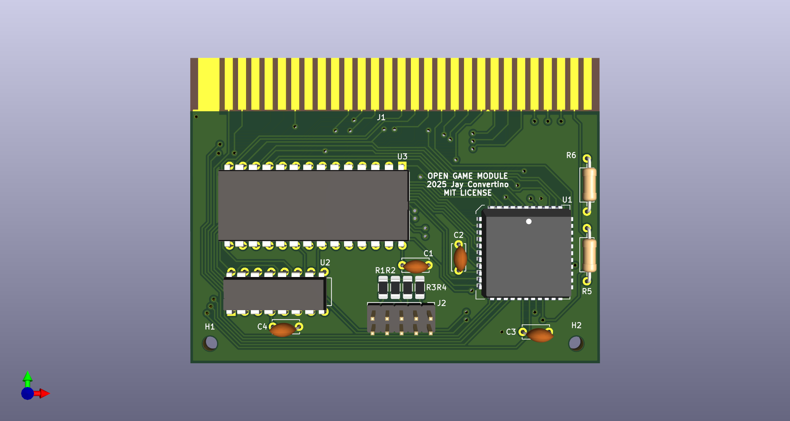
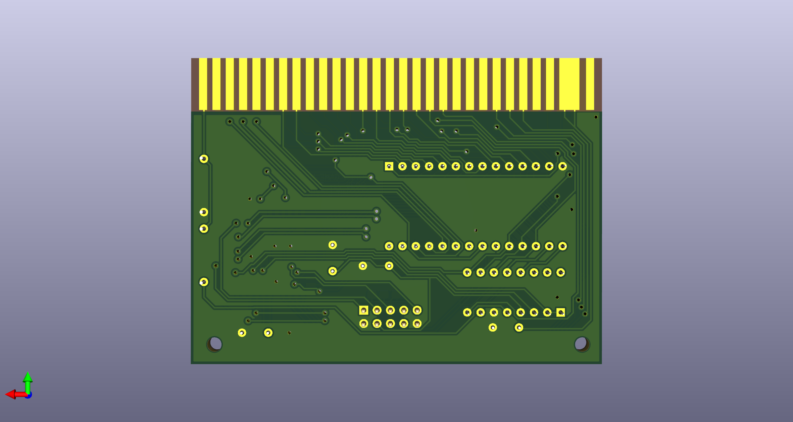

# Open Game Module
### Schematic, PCB, and CPLD design.

---

  author: Jay Convertino

  date: 2025.05.21

  details: Open Game Module Expansion for the Coleocvision that is Super Game Module compatible.

  license: MIT

---

## LICENSE
  - All files related to or generated from the KiCAD source fall under the MIT license.
  - All files related to or generated from the Verilog source fall under the MIT license.
  - All files generated by me, Jay Convertino, fall under the MIT license.
  - All files from other sources fall under the license of their specification.

## RELEASE VERSIONS
### Current
  - 1.0.0 - First working version

### Past
  - DEV

## Intro
  This is a open source version of the Super Game Module. This uses a CPLD for the glue logic.

## Documentation
  For detailed usage information, please navigate to one of the following sources. They are the same, just in a different format.
  - [open_game_module.pdf](docs/manual/open_game_module.pdf)
  - [github page](https://sparkletron.github.io/open_game_module/)

## SOFTWARE REQUIREMENTS
  - KiCAD v8.X
  - Quartus v13.0.1sp1 web edition
  - Altera USB Blaster

## BUILD TIPS
  This design is made so anyone can build this. Though it will need a board from a PCB manufacture due to the small pitch and
  vias. There are only a few SMD devices, the CPLD, and a few resistors. These are larger to help make soldering easier.

  Recommend populating the SMD parts first, then moving on to the through hole parts from passive to active.

  All case parts are ABS Plastic.

## Completed Project Image

## PCB IMAGE

